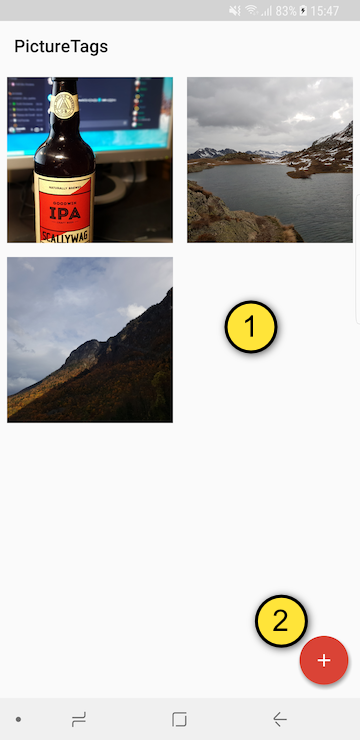
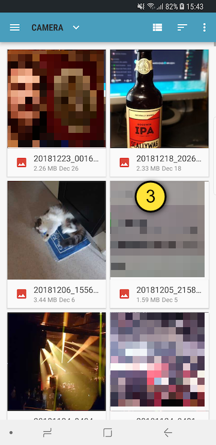
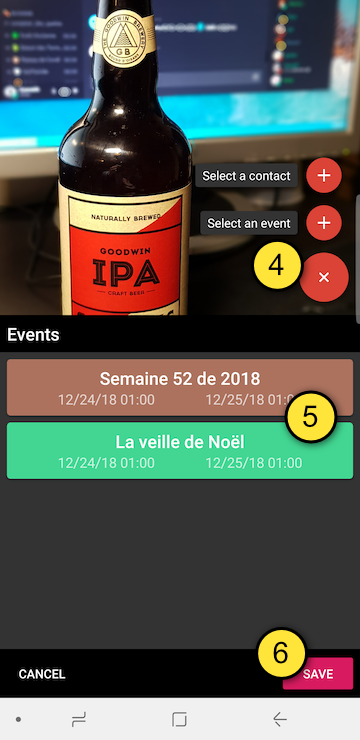
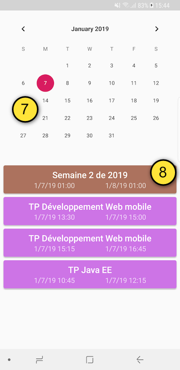
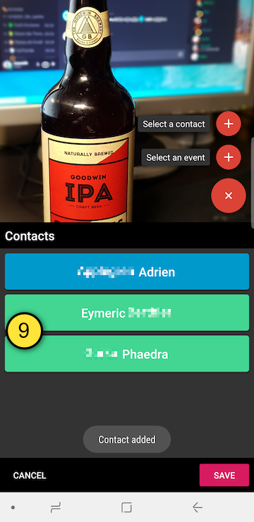

# Picture Tags

> Master 2 MIASHS WIC - UE DWM / Stanyslas Bres

## Subject

This application was designed and developed to familiarize with native Android development. It uses Room database, Picasso and Gson.

With this application, you can select an image from you device and annotate it with events or contacts.

## Possible improvements

  - Add GPS location to a picture.
  - Add text description to a picture.
  - Filter pictures by events/contacts/location/etc.
  - Batch delete.

## Compatibility

| minSdkVersion | targetSdkVersion | compileSdkVersion |
|:-------------:|:----------------:|:-----------------:|
| 21 (Lollipop) |     27 (Oreo)    |     27 (Oreo)     |

## Supported Languages

| flag | code  |
|------|-------|
| 🇺🇸  | en-US |
| 🇫🇷  | fr-FR |

## Usage

To fully enjoy the app's capabilities, you'll need two permissions :
  - Read events from calendar.
  - Read contacts.
  
These permissions are required to attach and display metadata linked to the picture. You can deny access to these permissions but you'll be unable to add the metadata...

  1. The list of already annotated pictures, **click to edit** annotations, **long click to delete** the picture.
  2. Press this FAB to open the image picker, to **annotate a new picture**.
  3. Press a picture to start annotate it, if you select an already annotated picture, you'll edit it.
  4. Press this button to add an event or a contact to your picture, this may require additional permissions.
  5. This is the list of events attached to the picture, **press one to remove it**.
  6. Press the save button to save changes and go back to the list of annotated pictures.
  7. While on the event picker, **select a day to see all its events**.
  8. Click an event to add it to the picture.
  9. The list of contacts linked to the picture, **click to delete**, **swipe left/right to switch between events and contacts views**.
  
## LICENSE

[MIT](LICENSE.md)
